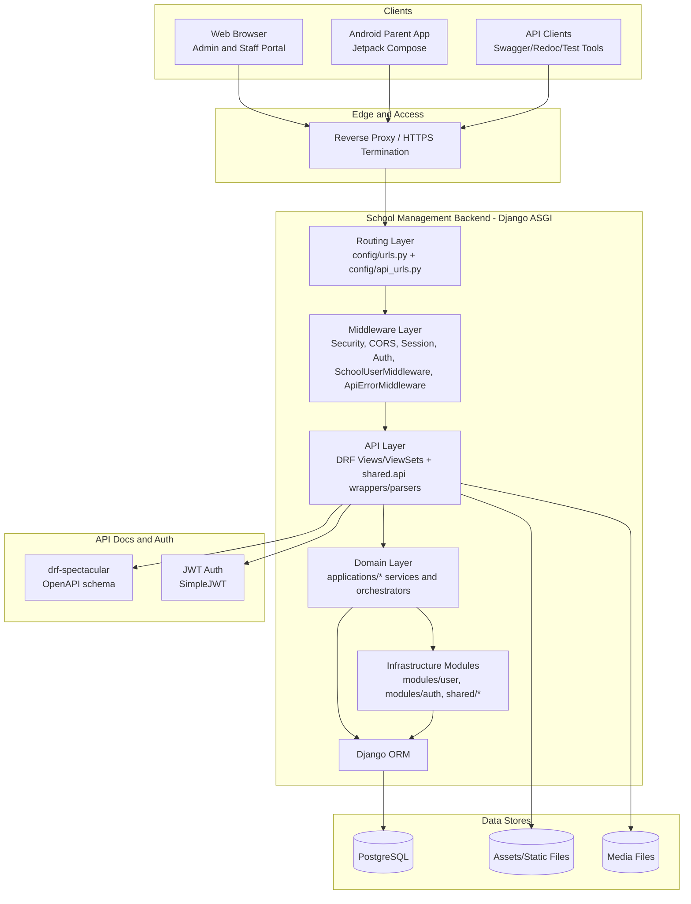
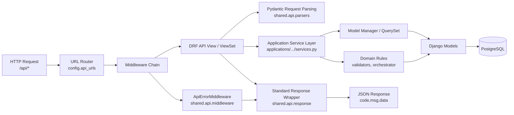

# School Management App Architecture Diagram

Date: April 23, 2026  
Scope: Current architecture with near-term module expansion points

## 1. System/Container Architecture

## 2. Backend Internal Architecture

## 3. Module Boundaries

- config: settings, ASGI/WSGI entry points, root and API URL composition.
- modules: reusable infrastructure components (custom user model, auth rules).
- applications: business domain modules (academic setup, user management, school management domains).
- shared: cross-cutting utilities (base models, API middleware/parsers/response, common helpers).
- assets/templates: web UI static and template resources.

## 4. Current Implemented Domain Modules

- applications.academic_setup
- applications.user_management
- applications.school_management.academic_management
- applications.school_management.grade_management
- applications.school_management.staff_management

## 5. Planned Expansion Modules (Architecture Extension Points)

- applications.school_config
- applications.auth_api
- applications.school_management.student_management
- applications.school_management.parent_management
- applications.school_management.attendance
- applications.school_management.reports
- applications.school_management.schedule
- applications.school_management.announcements

## 6. Key Architectural Characteristics

- Modular monolith: single deployable backend with clear module boundaries.
- API-first backend: standardized JSON envelope and explicit error handling.
- Role-based access control: custom user model + groups + role field.
- Single-instance school deployment: one installation serves one school.
- Mobile integration ready: JWT, OpenAPI docs, and consistent response contracts.
