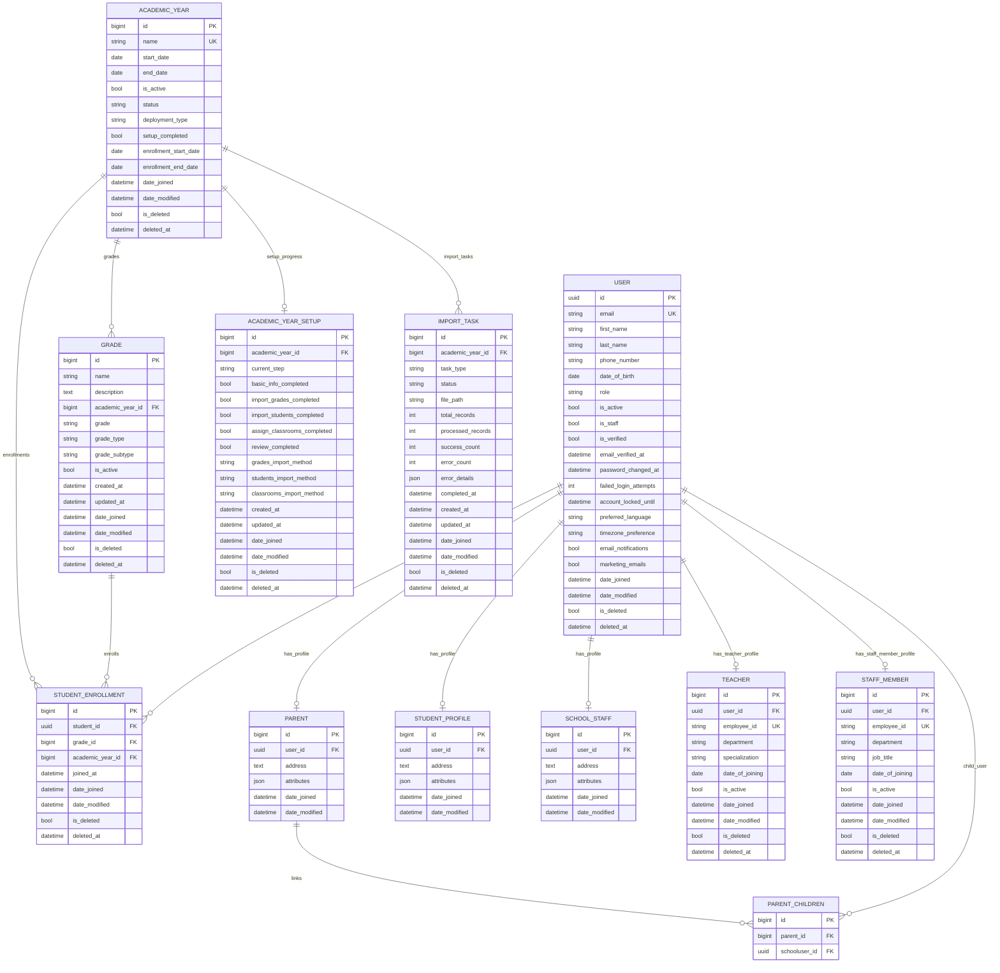

# School Management System ERD

Date: April 23, 2026  
Source: Generated from implemented code models after scanning the workspace.

## Scanned Model Sources

- applications/academic_setup/models.py
- applications/user_management/models.py
- applications/school_management/academic_management/models.py
- applications/school_management/grade_management/models.py
- applications/school_management/staff_management/models.py
- modules/user/models.py
- shared/base_models.py
- modules/user/mixins.py

## Entity Relationship Diagram (Mermaid)

## Relationship Notes

- `SchoolUser` is a proxy model over `User`; it does not create a separate DB table.
- `BaseUserType` is abstract and contributes fields to `Parent`, `Student` (shown as `STUDENT_PROFILE`), and `SchoolStaff`.
- Parent-to-children relation is represented by an implicit Django M2M table (`PARENT_CHILDREN` above).
- `Grade.students` is an M2M to `User` through `StudentEnrollment`.
- Soft-delete fields (`is_deleted`, `deleted_at`) are inherited through `BaseSoftDeletableModel` on most domain entities.

## Important Constraints Captured from Code

- `AcademicYear.name` is unique.
- `AcademicYearSetup.academic_year` is one-to-one.
- `Teacher.employee_id` and `StaffMember.employee_id` are unique.
- `StudentEnrollment` unique active constraint: one student per academic year where not soft-deleted.
- `Grade` unique tuple: (`name`, `grade`, `academic_year`, `grade_type`, `grade_subtype`).

## Exclusions

- Django auth internals (`auth_group`, permissions M2M) are not expanded in this ERD.
- Abstract base tables are not shown as physical entities.
