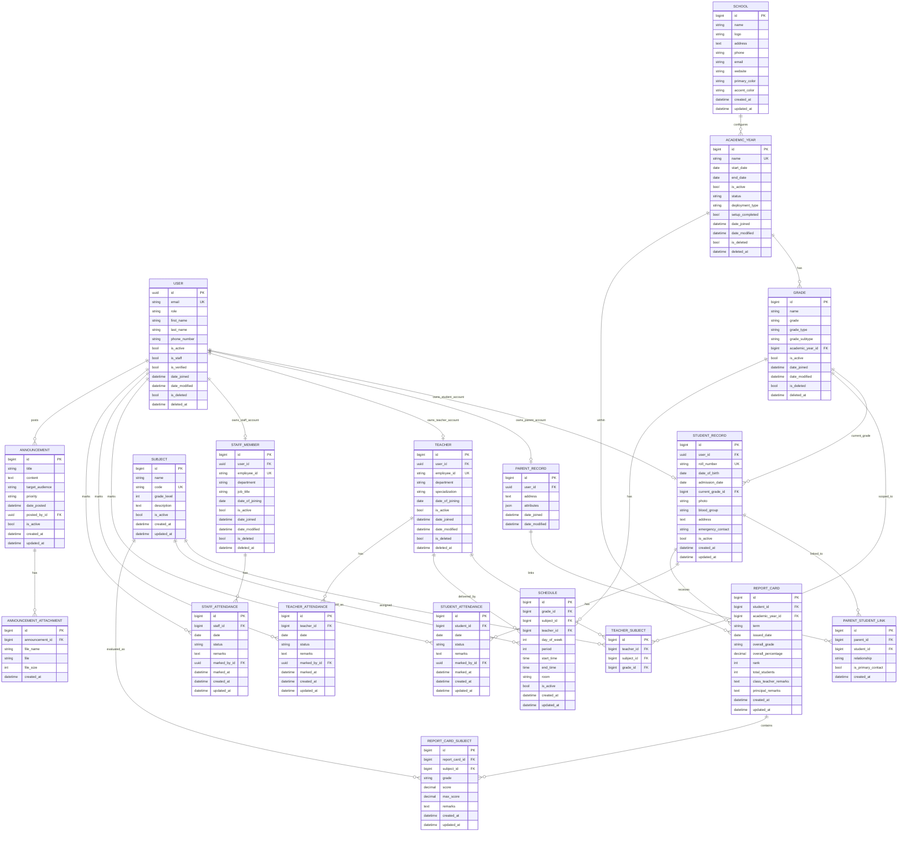

# School Management System ERD (Future / Unimplemented Modules)

Date: April 23, 2026  
Scope: Target-state ERD for modules that are planned or partially unimplemented in current code.

This ERD is intended to complement the current implemented ERD (`SCHOOL_MANAGEMENT_ERD.md`) and focuses on planned entities for:
- school configuration
- student domain expansion (full student record with roll number, admission date, etc.)
- parent-student explicit linking (with relationship metadata)
- subjects and teacher-subject assignment
- schedule/timetable
- attendance (student, teacher, staff)
- report cards
- announcements

> **Note on current thin profiles**: The existing `applications.user_management` app already has thin `Student` and `Parent` profile models (a OneToOne to `User` with only `address` and `attributes` fields). The future `student_management` and `parent_management` modules described here represent the full domain expansion with dedicated records. When those modules are implemented, the thin profiles may be extended or replaced.

## References Used

- `.github/copilot-instructions.md` — authoritative backend design and architecture reference
- `.github/api-reference.md` — target API contract for mobile/parent endpoints
- `.github/mobile-dev.md` — mobile integration plan
- `docs/ERD/SCHOOL_MANAGEMENT_ERD.md` — current implemented schema (authoritative source)

> Note: `.github/database-schema.md` references an earlier design iteration. The field definitions and table names in that file do not match the current implementation. This future ERD is aligned with `copilot-instructions.md` and the current codebase as the authoritative sources.

## Target-State ERD (Mermaid)

## Module-to-Entity Mapping

- school_config (future): SCHOOL
- student_management (future): STUDENT_RECORD, PARENT_STUDENT_LINK
- parent_management (future): PARENT_RECORD, PARENT_STUDENT_LINK
- attendance (future): STUDENT_ATTENDANCE, TEACHER_ATTENDANCE, STAFF_ATTENDANCE
- reports (future): REPORT_CARD, REPORT_CARD_SUBJECT
- schedule (future): SCHEDULE, SUBJECT, TEACHER_SUBJECT
- announcements (future): ANNOUNCEMENT, ANNOUNCEMENT_ATTACHMENT

## Planned Constraints (Recommended)

- Single active school record (singleton behavior) for SCHOOL.
- Unique: SUBJECT.code.
- Unique: PARENT_STUDENT_LINK(parent_id, student_id).
- Unique: TEACHER_SUBJECT(teacher_id, subject_id, grade_id).
- Unique: SCHEDULE(grade_id, day_of_week, period).
- Unique: STUDENT_ATTENDANCE(student_id, date).
- Unique: TEACHER_ATTENDANCE(teacher_id, date).
- Unique: STAFF_ATTENDANCE(staff_id, date).
- Unique: REPORT_CARD(student_id, academic_year_id, term).
- Unique: REPORT_CARD_SUBJECT(report_card_id, subject_id).

## Gap vs Current Implemented ERD

The following entities are future/unimplemented or only partially represented today:
- SCHOOL
- SUBJECT
- TEACHER_SUBJECT
- STUDENT_RECORD (expanded student domain fields)
- PARENT_STUDENT_LINK with relationship metadata
- SCHEDULE
- STUDENT_ATTENDANCE
- TEACHER_ATTENDANCE
- STAFF_ATTENDANCE
- REPORT_CARD
- REPORT_CARD_SUBJECT
- ANNOUNCEMENT
- ANNOUNCEMENT_ATTACHMENT
